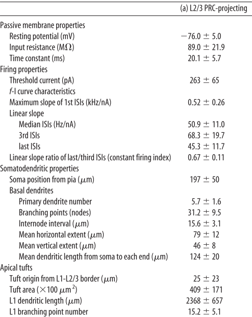
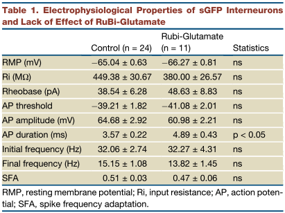

# Single Cell Write up
#### updated 5/22/24
## Cell types
The current plan is to use 3 cell types. The cells will be PN,FSI and LTS. 

## Cell ratio
We will use a 87,9,4 ratios for PN,FSI and LTS cells in our model. The 87:13 ratio for excitatory:inhibitory neurons is from Lefot el al 2009. The ratio for FSI:LTS cells is from Kätzel et all 2010 and Wall et al 2016

## PN cell
The PN single cell properties we will be using are from Hirai et al 2012

## FSI cell

We plan on using the same cell as the L5 M1 model. If we wanted to switch this for a more L2/3 version I don't yet have data.
## LTS cell

We plan on using the same cell as the L5 M1 model, but if we do want to change the cell these are the values we would shoot for from Fino et al 2011

## Other models
The Dura-Bernal et al 2023 paper has templates for PN cell which they call an IT cell. They also have data for FSI and LTS cells. However while their cells are written in HOC format they appear to be wrong and load the cells and then add a bunch of stuff from a python script before placing them in the model. For example the LTS cell they have in their repo has a RMP of -45mV which is clearly not correct. This would need to be investigated further.

## References 
Dura-Bernal, S., Neymotin, S. A., Suter, B. A., Duguid, I., Shepherd, G. M. G., Lytton Correspondence, W. W., Dacre, J., Moreira, J. V. S., Urdapilleta, E., Schiemann, J., & Lytton, W. W. (2023). Multiscale model of primary motor cortex circuits predicts in vivo cell-type-specific, behavioral state-dependent dynamics. Cell Reports, 42. https://doi.org/10.1016/j.celrep.2023.112574

Fino, E., & Yuste, R. (2011). Article Dense Inhibitory Connectivity in Neocortex. Neuron, 69(6), 1188–1203. https://doi.org/10.1016/j.neuron.2011.02.025

Hirai, Y., Morishima, M., Karube, F., & Kawaguchi, Y. (2012). Specialized Cortical Subnetworks Differentially Connect Frontal Cortex to Parahippocampal Areas. The Journal of Neuroscience, 32(5), 1898. https://doi.org/10.1523/JNEUROSCI.2810-11.2012

Kätzel, D., Zemelman, B. v., Buetfering, C., Wölfel, M., & Miesenböck, G. (2010). The columnar and laminar organization of inhibitory connections to neocortical excitatory cells. Nature Neuroscience 2010 14:1, 14(1), 100–107. https://doi.org/10.1038/nn.2687

Lefort, S., Tomm, C., Floyd Sarria, J. C., & Petersen, C. C. H. (2009). The Excitatory Neuronal Network of the C2 Barrel Column in Mouse Primary Somatosensory Cortex. Neuron, 61(2), 301–316. https://doi.org/10.1016/J.NEURON.2008.12.020

Wall, N. R., de la Parra, M., Sorokin, J. M., Taniguchi, H., Huang, Z. J., & Callaway, E. M. (2016). Brain-Wide Maps of Synaptic Input to Cortical Interneurons. Journal of Neuroscience, 36(14), 4000–4009. https://doi.org/10.1523/JNEUROSCI.3967-15.2016
