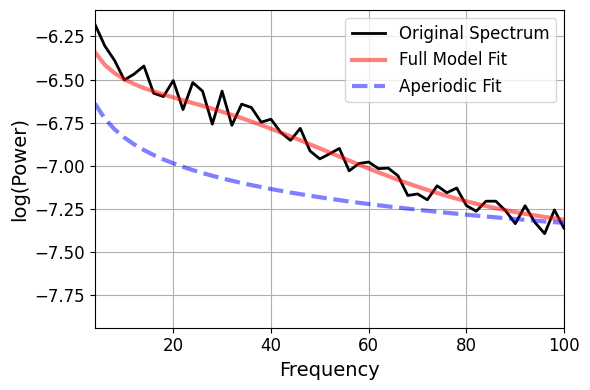
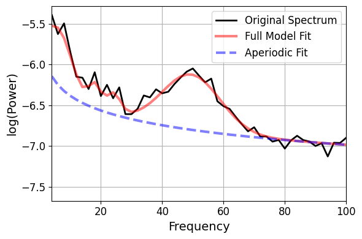
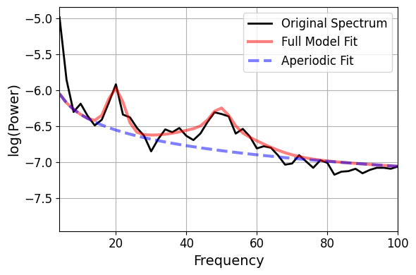

# Model results 6/22/24

## Baseline
Firing rate: mean, std\
PN: 1.64, 1.92\
FSI: 7.37, 7.83\
LTS: 4.88, 6.04\
\
CF:  26.00, PW:  0.389, BW: 60.16

## Short pulse
Stimulus on time:\
Firing rate: mean, std\
PN: 3.48, 2.13\
FSI: 28.8, 17.6\
LTS: 7.32, 6.64\
\
CF:   6.23, PW:  0.702, BW:  8.93                                  
CF:  18.00, PW:  0.321, BW:  4.00                                  
CF:  24.15, PW:  0.271, BW:  4.47                                  
CF:  49.50, PW:  0.678, BW: 18.88  

## Long pulse
Stimulus on time:\
Firing rate: mean, std\
PN: 2.17, 1.55\
FSI: 4.5, 4.24\
LTS: 18.6, 8.76\
\      
CF:  20.04, PW:  0.584, BW:  4.72                                 
CF:  49.52, PW:  0.593, BW: 21.05                                 
CF:  49.77, PW:  0.593, BW:  5.30\
Note: Gamma only occurs during first ~200ms of the trial.